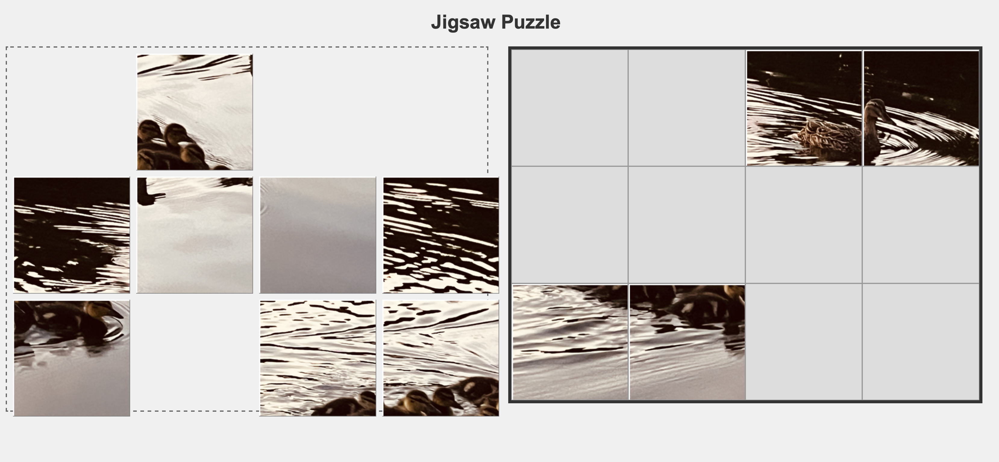

# Jigsaw Puzzle Generator

This web application allows users to upload an image and turn it into a playable jigsaw puzzle directly in their browser. This project is designed to be a simple, fun demonstration of web development with Python and Flask.



## 🎯 MVP Features

The goal of the Minimum Viable Product (MVP) is to deliver the core functionality with a clean interface.

-   **Image Upload:** Users can upload a JPG, PNG, or HEIC image from their computer.
-   **Automatic Slicing:** The backend automatically slices the uploaded image into a user-defined grid of puzzle pieces.
-   **Interactive Puzzle Board:** A simple drag-and-drop interface where users can solve the puzzle.
-   **Snap-to-Grid:** Pieces snap into the correct position on the board.

## 💻 Technology Stack

-   **Backend:** Python with the Flask web framework.
-   **Image Processing:** Pillow and pillow-heif libraries.
-   **Frontend:** HTML, CSS, and vanilla JavaScript.

## 📂 Project Structure

The project uses a standard Flask application structure to keep code organized and maintainable.

```
jigsaw_puzzles/
├── app.py              # Main Flask application
├── requirements.txt    # Python dependencies
├── static/             # For CSS, JavaScript, and static images
├── templates/          # For HTML files
├── uploads/            # Temporary storage for user-uploaded images
└── output/             # Storage for generated puzzle pieces
```

## 🚀 How to Run

1.  **Clone the repository:**
    ```sh
    git clone <your-repo-url>
    cd jigsaw_puzzles
    ```

2.  **Create and activate a virtual environment:**
    ```sh
    # Using venv
    python -m venv venv
    source venv/bin/activate

    # Or using Conda
    conda create --name jigsaw python=3.9
    conda activate jigsaw
    ```

3.  **Install the dependencies:**
    ```sh
    pip install -r requirements.txt
    ```

4.  **Run the Flask application:**
    ```sh
    flask run
    ```

5.  Open your web browser and navigate to `http://127.0.0.1:5000` to use the app.